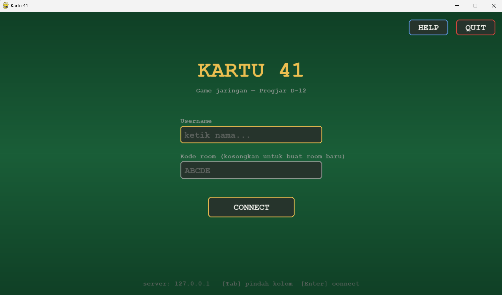
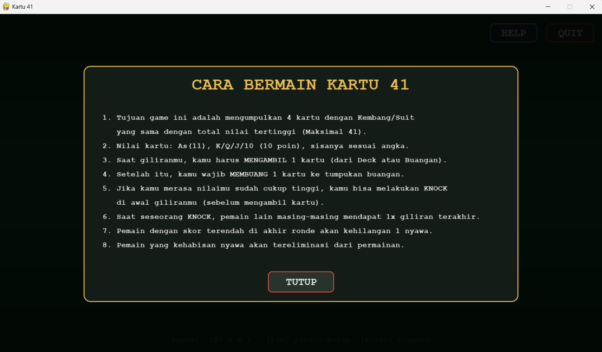
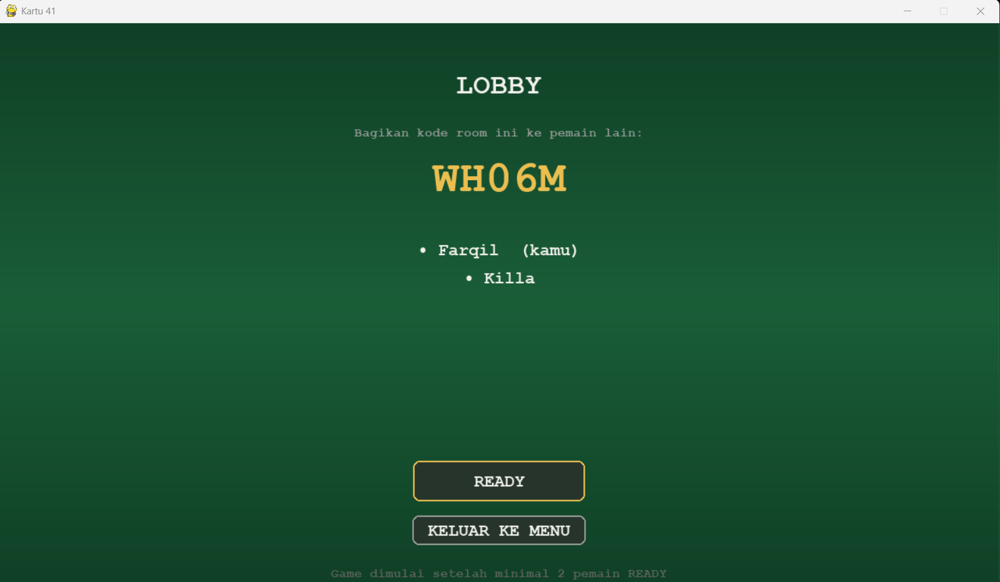
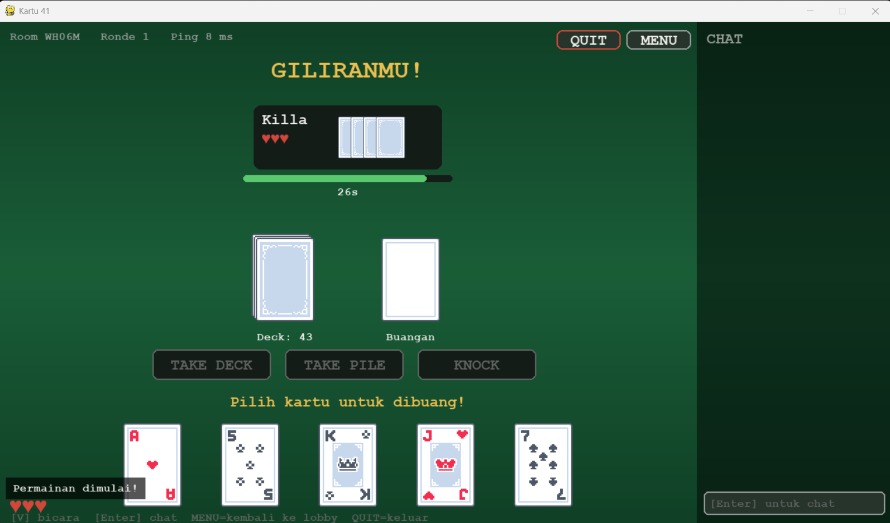
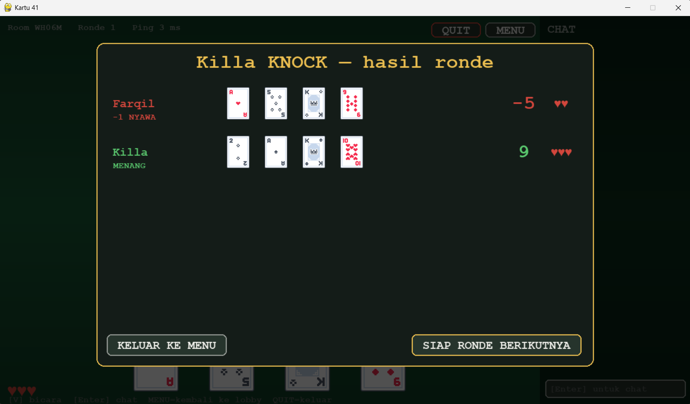
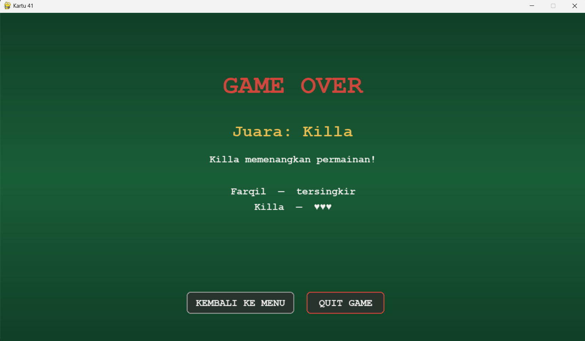

[](https://classroom.github.com/a/4SHtB1vz)
# Network Programming - Final Project [G04]

## Anggota Kelompok
| Nama           | NRP        | Kelas     |
| ---            | ---        | ----------|
| Farrel Aqilla Novianto | 5025241015 | Pemrograman Jaringan D |
| Vityaz Ali Firdaus | 5025241050 | Pemrograman Jaringan D |
| Uwais Achmad | 5025241103 | Pemrograman Jaringan D |

## Link Youtube (Unlisted)
Link ditaruh di bawah ini
```
https://youtu.be/AwoUMJ4iehE
```

## Penjelasan Program

### 1. `constants.py`
 
Berisi semua konstanta yang dipakai di seluruh program:
 
- `SUITS`, `RANKS` — daftar jenis dan nilai kartu
- `CARD_VALUES` — mapping rank ke nilai angka (As=11, J/Q/K/10=10, angka=nominalnya)
- `SUIT_SYMBOLS` — simbol unicode tiap suit (♠♥♦♣)
- `MIN_PLAYERS`, `MAX_PLAYERS`, `INITIAL_LIVES` — konfigurasi game (2–4 pemain, 3 nyawa)
- `FIRST_PLAYER_CARDS`, `OTHER_PLAYER_CARDS` — pemain pertama dapat 5 kartu, sisanya 4
- `ACTION_*`, `SOURCE_*`, `MSG_*` — konstanta string untuk tipe aksi dan tipe pesan protokol
- Konfigurasi jaringan: `DEFAULT_HOST`, `DEFAULT_PORT`, `BUFFER_SIZE`, timeout ping/reconnect
---
 
### 2. `protocol.py`
 
Helper untuk encode dan decode pesan JSON yang dikirim lewat socket.
 
- `encode(msg_type, payload)` — bungkus pesan jadi `{"type": ..., "payload": ...}` lalu encode ke bytes dengan `\n` di akhir sebagai terminator
- `decode(raw)` — parse string JSON kembali ke dict
- Fungsi shortcut seperti `encode_game_state()`, `encode_action_request()`, `encode_round_end()`, dst. — masing-masing memanggil `encode()` dengan tipe pesan yang sesuai
- `recv_message(sock)` — baca dari socket sampai ketemu `\n`, lalu decode hasilnya
---
 
### 3. `game_engine.py`
 
Inti logika permainan. Tidak tahu soal jaringan sama sekali — murni game logic.
 
#### `Card`
Representasi satu kartu. Punya properti `value` (ambil dari `CARD_VALUES`), method `to_dict()` dan `from_dict()` untuk serialisasi ke/dari JSON.
 
#### `Deck`
Buat 52 kartu (semua kombinasi suit × rank), langsung dikocok saat init. Method `draw()` ambil kartu dari atas, `is_empty()`, `remaining()`.
 
#### `calculate_score(hand)`
Fungsi bebas (bukan method class). Hitung skor tangan:
1. Kelompokkan nilai kartu per suit
2. Suit dengan total nilai tertinggi = mayoritas
3. Skor = total mayoritas − total suit lainnya
Skor bisa negatif jika kartu minoritas totalnya lebih besar.
 
#### `ActivityLog`
Catat semua kejadian per ronde (take, discard, knock, round end, game over) dengan timestamp. Bisa difilter per ronde atau per pemain.
 
#### `GameEngine`
Kelas utama yang mengelola satu sesi permainan.
 
**Init:** terima list `player_ids`, buat lives (3 tiap orang), tangan kosong, deck baru, log kosong.
 
**`start_round()`** — reset deck & tangan, bagikan kartu (pemain pertama 5, sisanya 4), set flag `_waiting_initial_discard = True`.
 
**`initial_discard(player_id, card_index)`** — pemain pertama wajib buang 1 kartu sebelum ronde benar-benar aktif. Setelah ini `round_active = True` dan giliran pindah ke pemain ke-2.
 
**`take_card(player_id, source)`** — validasi giliran, ambil dari `DECK` atau `DISCARD`, tambah ke tangan pemain, catat di log.
 
**`discard_card(player_id, card_index)`** — validasi giliran, buang kartu ke discard pile, panggil `_advance_turn()`. Jika deck habis setelah discard, result diberi flag `trigger: DECK_EMPTY`.
 
**`knock(player_id)`** — validasi giliran, langsung panggil `_resolve_round()`.
 
**`force_showdown()`** — panggil `_resolve_round()` tanpa knocker (dipakai saat deck habis).
 
**`_resolve_round(knocker)`** — hitung skor semua pemain, tentukan pemenang (bisa lebih dari satu jika seri), kurangi nyawa pemain yang kalah, cek eliminasi dan game over, kembalikan dict hasil lengkap.
 
**`_advance_turn()`** — pindah giliran ke pemain berikutnya, skip pemain yang nyawanya 0.
 
**`get_state_for_player(viewer_id)`** — kembalikan state yang aman dilihat pemain tertentu: kartu sendiri terlihat penuh, kartu lawan hanya `card_count`.
 
**`get_reconnect_snapshot(player_id)`** — sama seperti `get_state_for_player` tapi ditambah `player_order` dan flag `reconnected: True`.
 
---
 
### 4. `session.py`
 
Jembatan antara jaringan dan game engine. Mengelola room dan state per sesi.
 
#### `PlayerInfo`
Data sederhana per pemain: `player_id`, `username`, `sock`, status `connected`, waktu disconnect, dan status `ready`.
 
#### `GameSession`
State satu room dari lobby sampai game over.
 
**State room:** `LOBBY` → `MATCHMAKING` → `DEAL_CARDS` → `PLAYER_TURN` → `LAST_TURN_PHASE` → `WAITING_READY` → (ronde baru atau `GAME_OVER`)
 
**`add_player()`** — tambah pemain ke room (hanya saat LOBBY, max 4 orang), broadcast `PLAYER_JOINED` ke semua.
 
**`try_start_game()`** — jika min 2 pemain dan semua ready, broadcast `GAME_START` dan panggil `_start_round()`.
 
**`_start_round()`** — buat `GameEngine` (atau gunakan yang ada), panggil `engine.start_round()`, kirim kartu ke tiap pemain via `_send_all_hands()`, broadcast game state, prompt pemain yang giliran.
 
**`_prompt_current_player()`** — broadcast `TURN_INDICATOR` ke semua, kirim `VALID_ACTIONS` khusus ke pemain yang giliran, mulai timer 30 detik.
 
**`_on_turn_timeout()`** — jika pemain tidak bertindak dalam 30 detik, aksi dipilihkan otomatis (auto-skip).
 
**`handle_packet(player_id, msg)`** — router utama: terima pesan dari `ClientHandler`, arahkan ke handler yang sesuai berdasarkan `msg["type"]` (READY, TAKE_DECK, TAKE_DISCARD, DISCARD, KNOCK, CHAT, PING, dll.).
 
**`on_player_disconnect()`** — tandai pemain sebagai tidak terkoneksi. Jika sedang di LOBBY → hapus. Jika game aktif → mulai timer reconnect 60 detik. Jika giliran pemain itu → auto-skip.
 
**`reconnect_player()`** — update socket pemain, kirim `RECONNECT_ACK` berisi snapshot state penuh (termasuk kartu tangan, state ronde, sisa waktu giliran), broadcast `PLAYER_RECONNECTED`.
 
**`_on_reconnect_timeout()`** — jika 60 detik lewat dan pemain belum kembali → eliminasi, broadcast `PLAYER_ELIMINATED_DISCONNECT`.
 
#### `RoomManager`
Registry global semua room aktif.
 
- `register_player()` — buat player_id baru, buat room baru jika tidak ada room_code, atau join room yang ada. Return `(player_id, room_code, error)`.
- `reconnect_player()` — validasi player_id dan room_code, delegasikan ke `GameSession.reconnect_player()`.
- `get_session()` — ambil session berdasarkan room_code.
---
 
### 5. `server.py`
 
Entry point server. Menggabungkan semua komponen.
 
#### Fungsi bantu
- `_encode(msg)` — dict → bytes JSON + `\n`
- `_decode(raw)` — string → dict
- `_recv_message(sock)` — baca dari socket sampai newline, decode JSON
#### `ClientHandler` (Thread)
Satu thread per koneksi masuk.
 
**`run()`** — jalankan `_handshake()`, lalu jika berhasil jalankan `_message_loop()`, terakhir `_on_disconnect()`.
 
**`_handshake()`** — terima satu pesan pertama. Jika `LOGIN`: panggil `room_manager.register_player()`, balas `LOGIN_ACK`. Jika `RECONNECT`: panggil `room_manager.reconnect_player()`.
 
**`_message_loop()`** — loop tak terbatas: terima pesan, validasi tipe via `_is_valid_packet()`, teruskan ke `session.handle_packet()`.
 
**`_is_valid_packet()`** — whitelist tipe pesan yang diizinkan. Pesan dengan tipe di luar daftar langsung ditolak.
 
**`_on_disconnect()`** — tutup socket, beritahu session via `on_player_disconnect()`, hapus dari registry koneksi.
 
#### `UDPVoiceRelay` (Thread)
Relay audio antar pemain dalam satu room.
 
- Listen di UDP `:5556`
- Tiap paket `VOICE_DATA` yang masuk: catat alamat pengirim, cari semua pemain lain di room yang sama, forward paket ke mereka
- Pemetaan `player_id → alamat UDP` disimpan di `_addr_map`
#### `GameServer`
- Buat `RoomManager` dan `UDPVoiceRelay`
- Listen TCP di `:5555`, spawn `ClientHandler` untuk tiap koneksi baru
- `_connections` — dict `player_id → ClientHandler` untuk lookup cepat
---
 
### 6. `input_handler.py`
 
Menangani semua input pengguna dari Pygame, tanpa logika game sama sekali.
 
#### Fungsi bantu internal
 
**`_submit_login(state, net, reconnect)`** — ambil username & room dari state UI, panggil `net.connect()` lalu kirim `LOGIN` atau `RECONNECT`.
 
**`_send_discard(state, net, index)`** — validasi index kartu, kirim `DISCARD` ke server.
 
**`_send_chat(state, net)`** — ambil teks dari `chat_input`, kirim `CHAT`, kosongkan input.
 
**`_reset_to_connect(state, keep_session)`** — reset semua state ke kondisi awal layar CONNECT. Jika `keep_session=True`, simpan `player_id` dan `room_code` di `ui["last_session"]` untuk reconnect nanti.
 
#### `_handle_click(pos, state, net)`
Cari hitbox yang cocok dengan posisi klik (iterasi terbalik agar elemen paling atas diprioritaskan). Lalu dispatch ke aksi yang sesuai:
- Tombol `connect_btn` / `resume_btn` → login / reconnect
- `ready_btn` / `unready_btn` → kirim READY/UNREADY
- `deck` / `discard` → kirim TAKE_DECK / TAKE_DISCARD (hanya jika aksi valid)
- Kartu tangan `("hand", index)` → kirim DISCARD jika fase `MUST_DISCARD`
- Tombol menu → kirim LEAVE, tutup koneksi, reset state
#### `_handle_keydown(event, state, net, voice)`
- Jika ada field yang difokus → proses ketikan (backspace, tab, enter, karakter)
- Enter di luar field → submit login atau fokus ke chat
- Tahan `V` → `voice.set_talking(True)`, lepas → `False`
- Escape → hapus fokus atau keluar jika fase GAME_OVER
#### `handle(events, state, net, voice)`
Loop utama input — dipanggil tiap frame. Iterasi semua event Pygame dan delegasikan ke handler yang sesuai. Return `False` jika program harus keluar.
 
---
 
### 7. `voice.py`
 
Voice chat push-to-talk via UDP, opsional (graceful fallback jika `sounddevice`/`numpy` tidak tersedia).
 
#### `VoiceChat`
**`start()`** — kirim paket kosong ke server (agar server tahu alamat UDP pemain ini), mulai thread `_recv_loop`, buka stream input & output audio via `sounddevice`.
 
**`set_talking(talking)`** — toggle mode bicara. Saat `True`, update `state.speaking` agar UI menampilkan indikator sedang bicara.
 
**`_input_callback()`** — dipanggil PortAudio tiap ~50ms. Jika `self.talking = True`, kirim chunk audio mentah ke server via `_send_chunk()`.
 
**`_send_chunk(raw)`** — encode audio bytes ke base64, bungkus dalam JSON `VOICE_DATA`, kirim ke server via UDP.
 
**`_recv_loop()`** — thread terpisah. Terima paket UDP, decode JSON, abaikan paket dari diri sendiri. Decode audio dari base64, simpan ke buffer `_buffers[player_id]` sebagai numpy array.
 
**`_output_callback()`** — dipanggil PortAudio tiap ~50ms untuk playback. Mix audio dari semua buffer pemain (dijumlahkan), clip agar tidak overflow 16-bit, tulis ke output stream.
 
**`close()`** — stop semua stream audio, tutup socket UDP.
 
---
 
### 8. Test Files
 
#### `test_scoring.py`
Unit test untuk fungsi `calculate_score()` di `game_engine.py`.
 
Menguji: contoh dari PRD, semua suit sama, mayoritas tipis, 3 suit berbeda, skor negatif (valid), tangan kosong, satu kartu, nilai As/J/Q/K/10, dan urutan kartu tidak mempengaruhi skor.
 
#### `test_knock.py`
Unit test untuk alur knock dan resolusi ronde di `GameEngine`.
 
Menguji:
- `TestKnockResolution` — knock menang sendiri, seri, knock bukan giliran (ditolak), ronde tidak aktif (ditolak), eliminasi saat nyawa habis, game over saat 1 pemain tersisa, force showdown saat deck kosong, kelengkapan key di result
- `TestTurnFlow` — giliran awal, ambil dari deck/discard, sumber tidak valid, bukan giliran, discard setelah take, giliran pindah setelah discard, skip pemain yang sudah eliminasi
- `TestGetState` — kartu sendiri terlihat, kartu lawan tersembunyi, semua key ada, player tidak dikenal
#### `test_client_protocol.py`
Unit test untuk `LineFramer` dan fungsi `dispatch()` di `client.py`.
 
- `TestLineFramer` — pesan utuh, partial receive, beberapa pesan dalam satu chunk, unicode multibyte, baris rusak di-skip, baris kosong diabaikan, JSON bukan dict di-skip
- `TestDispatcherLobby` — LOGIN_ACK, PLAYER_JOINED, GAME_START, ERROR jadi toast
- `TestDispatcherInGame` — YOUR_HAND, GAME_STATE (dua ejaan berbeda), TURN_INDICATOR, VALID_ACTIONS, CARD_DRAWN, ROUND_END, NEXT_ROUND_PROMPT, GAME_OVER, disconnect/reconnect pemain, PONG latensi, CHAT_BROADCAST
- `TestDispatcherReconnect` — RECONNECT_ACK rebuild state, snapshot kosong kembali ke lobby
- `TestDispatcherDefensive` — tipe tak dikenal diabaikan, payload hilang/bukan dict, pesan bukan dict, cards=None tidak menimpa tangan

### Menjalankan Program

#### Prasyarat
```bash
pip install -r requirements.txt
```

#### Jalankan Server
```bash
py -m server.server
```
Server akan listen di TCP `:5555` dan UDP `:5556`.

#### Jalankan Client
```bash
py -m client.client --host:'127.0.0.1' --name:'Farrel' --roomcode:'ABCDE'
```
- Masukkan username
- Kosongkan room code untuk buat room baru, atau isi kode room untuk join
- Tekan **V** untuk voice chat (push-to-talk)

---

### Testing

Tersedia 3 file unit test yang bisa dijalankan tanpa server maupun Pygame:

```bash
# Test perhitungan skor
python -m pytest tests/test_scoring.py -v

# Test alur knock & resolusi ronde
python -m pytest tests/test_knock.py -v

# Test framing & dispatcher client
python -m pytest tests/test_client_protocol.py -v
```

| File Test | Cakupan |
|---|---|
| `test_scoring.py` | Fungsi `calculate_score()`: dominasi suit, edge case, nilai kartu |
| `test_knock.py` | Knock normal, seri, eliminasi, force showdown, alur giliran |
| `test_client_protocol.py` | LineFramer (parsing TCP), dispatcher semua tipe pesan, reconnect |

## Screenshot Hasil





